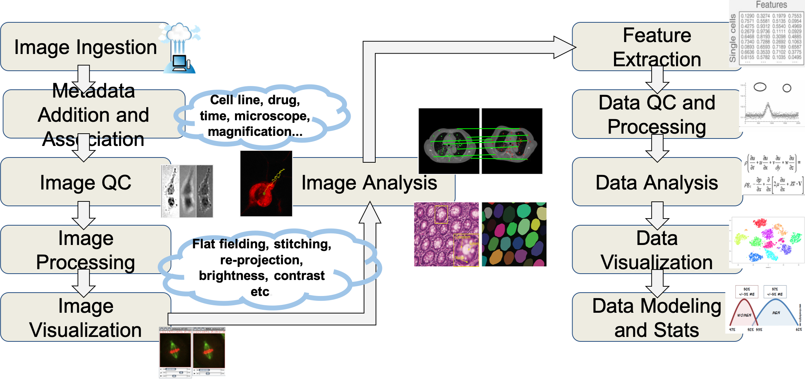

# WIPP - Web Image Processing Pipelines

## What is WIPP?

Web Image Processing Pipelines (WIPP) is an open-source web-based algorithmic plugin platform for trusted image-based measurements from terabyte-sized images developped at the National Institute of Standards and Technology (NIST), in collaboration with the National Institutes of Health (NIH) - National Center for Advancing Translational Science (NCATS).

The goal of this project is to lower the bar for users and algorithm developers to execute and share image analyses over terabyte-sized image collections in high-throughput and high content microscopy imaging applications. 
- Upload collections of microscopy images,
- Register algorithmic plugins,
- Configure image processing workflows,
- Stitch grids of small fields of view,
- Visualize and analyze large fields of view interactively using the pyramid view,
- Extract image features and customize scatterplots,
- Train and use Tensorflow models for image segmentation,
- Prototype algorithms with polyglot Jupyter notebooks.

WIPP is designed as an expandable platform leveraging containerization and orchestration technologies such as Docker and Kubernetes and is meant to be deployed on a Kubernetes cluster (see [Installation instructions](#installation)).

The core of the WIPP framework consists of:
- the [WIPP REST API](https://github.com/usnistgov/WIPP-backend), based on the Java Spring framework,
- the [WIPP web UI](https://github.com/usnistgov/WIPP-frontend), an Angular 7 application,
- a [MongoDB](https://www.mongodb.com/) database,
- [Argo Workflows](https://argoproj.github.io/argo/), a container native workflow engine for Kubernetes,
- WIPP Plugins, algorithmic plugins packaged as Docker images.

Additional tools can be added to the WIPP core for a more complete system:
- [JupyterHub](https://github.com/LabShare/notebooks-deploy), to develop polyglot Jupyter notebooks that can be used in WIPP workflows,
- [Plots](https://hub.docker.com/r/labshare/vision-ui), for scalable and interactive scatterplots visualization,
- [Tensorboard](https://www.tensorflow.org/tensorboard), for Tensorflow jobs monitoring,
- [Elastic Stack](https://www.elastic.co/what-is/elk-stack) for application, logs and system monitoring.

## Installation
For a quick start, we provide instructions for the deployment of a complete installation of WIPP on a single-node Kubernetes cluster.  

[Installing WIPP on a single-node cluster](deployment/wipp-complete-single-node/README.md)

Instructions are provided for popular operating systems using simple solutions for setting up a single-node Kubernetes cluster: 
- macOS (with Docker Desktop)
- macOS (with Multipass+microk8s)
- Linux (Multipass+microk8s)
- Windows 10 (Multipass+microk8s)

The following components are included in the single-node deployment:
- WIPP REST API and UI,
- MongoDB,
- Argo Workflows,
- JupyterLab,
- Plots,
- Tensorboard.

### GPU support - optional
We provide WIPP plugins for CNN-based segmentation using Tensorflow. These plugins require access to a GPU in the Kubernetes cluster.  
The requirements for running the using the [WIPP UNet CNN Semantic-Segmentation Training plugin](https://github.com/usnistgov/WIPP-unet-train-plugin) and [WIPP UNet CNN Semantic-Segmentation Inference plugin](https://github.com/usnistgov/WIPP-unet-inference-plugin) are:
- Cuda 10.1 installed,
- nvidia-docker-runtime and set as default docker runtime
- GPU support enabled in the cluster (for example, by installing the [NVIDIA Device Plugin for Kubernetes](https://github.com/NVIDIA/k8s-device-plugin) or enabling the `gpu` addon in microk8s)

Alternatively, some GPU cards may be compatible with the preview release of the [NVIDIA GPU Operator for Kubernetes](https://github.com/NVIDIA/gpu-operator), which aims to simplify NVIDIA GPU resources in Kubernetes clusters.

### Important security information
The WIPP framework is currently in beta version and instructions are provided for deploying a testing instance of the system.  
*The Web Image Processing Pipelines system (WIPP) version 3.0.0-beta does not include any web security management. WIPP 3.0.0-beta allows unrestricted uploading of files via the web browser interface and the uploaded files interact with the file system as well as with an instance of MongoDB database.
WIPP 3.0.0-beta is intended for deployment on private networks behind a firewall. Future releases will include account and upload access management.*

## WIPP plugins

Manifest files to install the currently available WIPP plugins can be found in the [plugins folder](plugins).

## Troubleshooting

If you encounter issues during the installation or usage of WIPP, you can get help using one of the following options:
- open an issue on the repository,
- send an email to the [WIPP team](mailto:wipp-team@nist.gov).

## References

- NIST article and video: 
    - A Map App to Track Stem Cells, [NIST news, February 13, 2018](https://www.nist.gov/news-events/news/2018/02/map-app-track-stem-cells)
- Reference book: 
    - [Web Microanalysis of Big Image Data](https://www.springer.com/us/book/9783319633596), published in January 2018 by Springer Verlag.
- Publications:
    - Peter Bajcsy, Antoine Vandecreme, Julien Amelot, Joe Chalfoun, Michael Majurski, and Mary Brady, “Enabling Stem Cell Characterization from Large Coverage Microscopy,” IEEE Computer, 2016: vol. 49, no. 7, pp. 70-79, [URL](https://www.computer.org/csdl/mags/co/2016/07/mco2016070070-abs.html)
    - Antoine Vandecreme, Tim Blattner, Michael Majurski, Peter Bajcsy, Keana Scott, and John Henry J. Scott, “From Image Tiles to Web-Based Interactive Measurements in One Stop,” Microscopy and Microanalyses, Portland, OR, August 2-6, 2015, [URL](https://www.microscopy.org/MandM/2015/index.cfm)

## How to cite our work

If you are using WIPP in your research, please use the following references to cite us.

Peter Bajcsy, Joe Chalfoun, and Mylene Simon (2018), "Web Microanalysis of Big Image Data", Springer-Verlag International, [URL](https://www.springer.com/us/book/9783319633596)

## Disclaimer

[NIST Disclaimer](LICENSE.md)