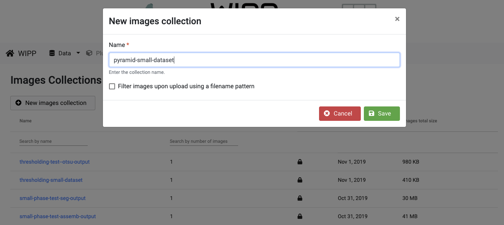
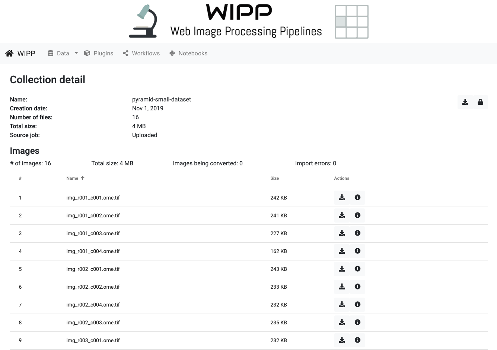
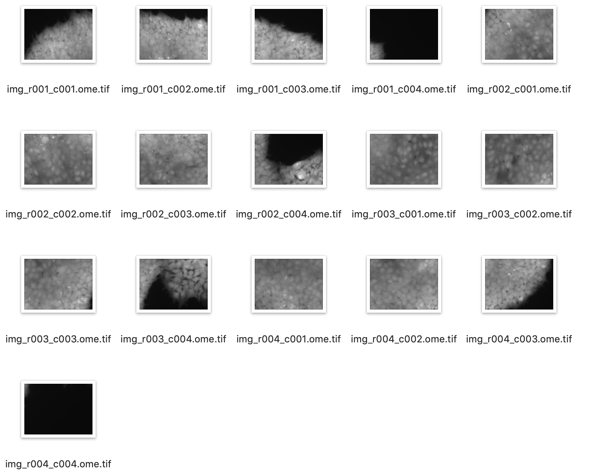
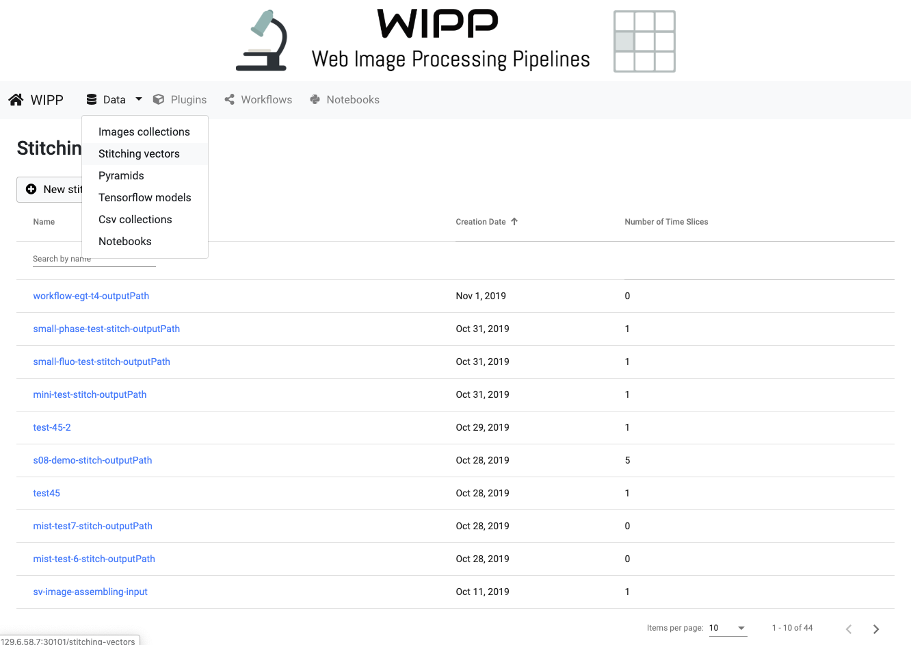
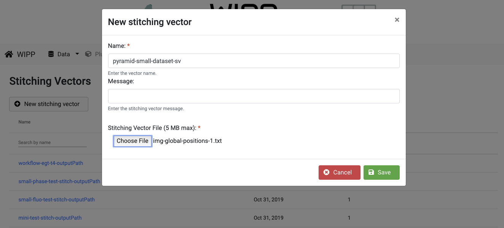
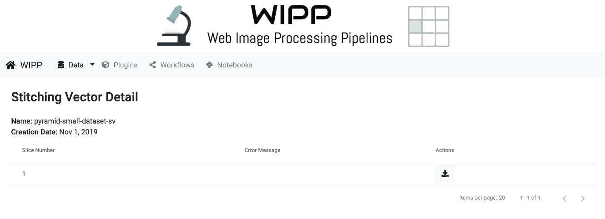
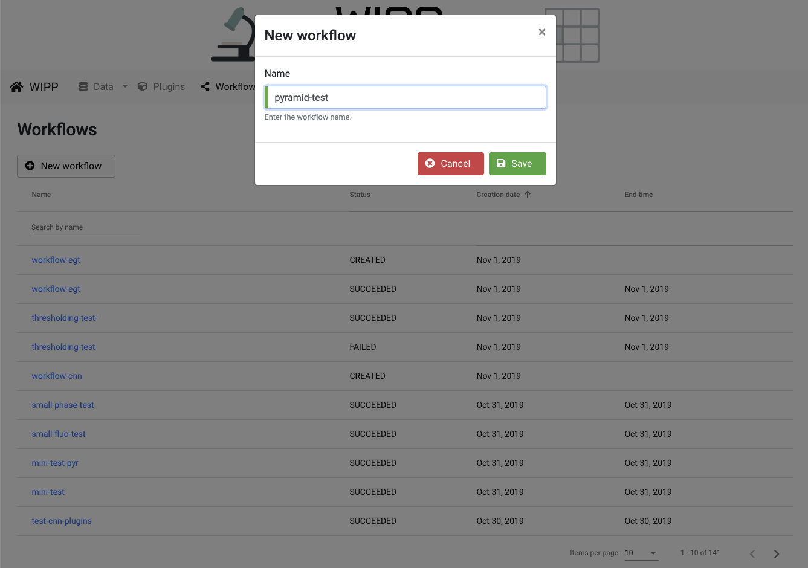
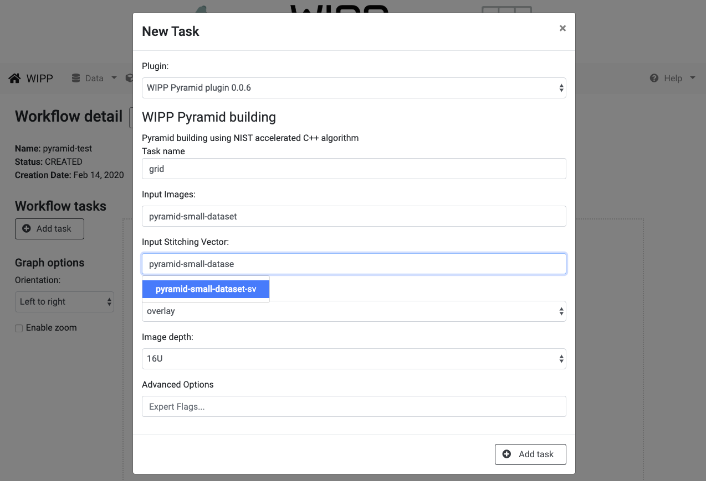
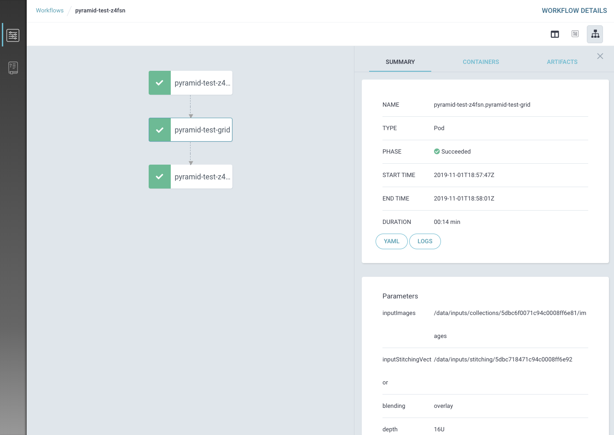
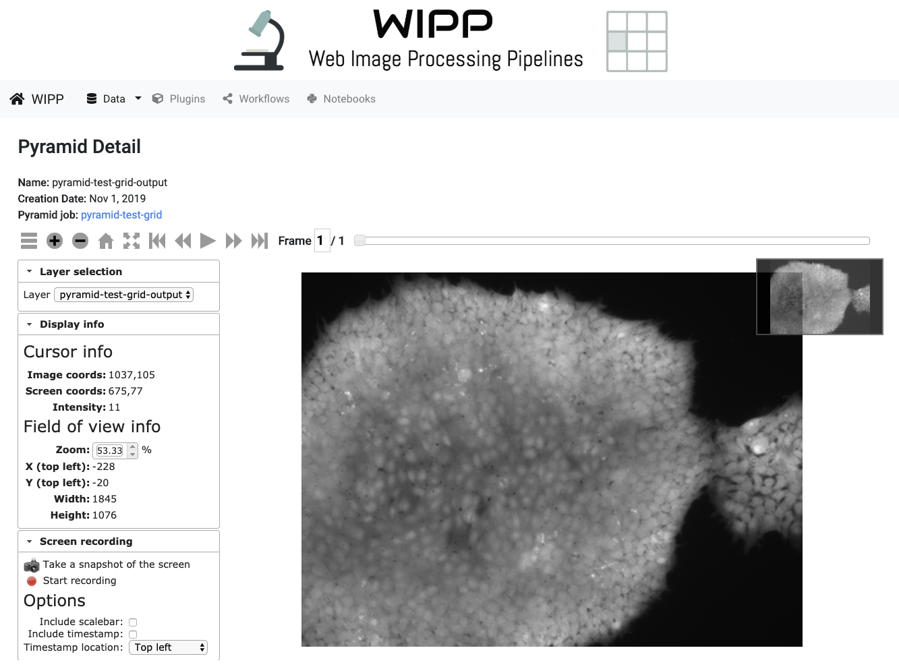

# Pyramid Building test

## Pre-requisites

- A running instance of the WIPP system ([installation instructions](../deployment/wipp-complete-single-node/README.md))
- Being familiar with the notions of images collections, plugins and workflows ([user guide](../user-guide/README.md))
- The following plugin is registered in the WIPP system being tested ([how to register a plugin](../user-guide/plugins/README.md)):
 - Pyramid Building ([link to plugin manifest](https://github.com/usnistgov/WIPP-pyramid-plugin/blob/master/wipp-pyramid-plugin.json))
 
## Upload images collection

Go to "Data" -> "Images collections".  

  

Click on "New images collection", fill in the Name field as "pyramid-small-dataset" and click on "Save".  

  

Upload the images located in the folder "inputCollection", wait for all images to be converted and lock the collection by clicking on the lock icon on the right.  

Input images:

## Upload stitching vector

Go to "Data" -> "Stitching vectors".  

  

Click on "New stitching vector", fill in the Name field as "pyramid-small-dataset-sv", choose file "img-global-positions-1.txt" located in the "inputStitchingVector" folder and click on "Save".  

  

The stitching vector will appear in the list, and the detail view can be accessed by clicking on the "pyramid-small-dataset-sv" row in the table. 

Input stitching vector:

 
## Create the workflow

Go to "Workflows".  

Click on "New workflow", fill in the Name field as "pyramid-test" and click on "Save".  

Click on "Add task" and choose "WIPP Pyramid plugin 0.0.6" in the dropdown list.  

Configure the task as follow:
- Task name: grid
- Input Images: start typing "pyramid-small-dataset" and select this collection from the list
- Input Stitching Vector: start typing "pyramid-small-dataset-sv" and select this stitching vector from the list
- Blending method: select "overlay"
- Image depth: select "16U"
- Advanced Options: leave empty

Click on "Add task"

Click on "submit workflow" to submit the workflow.

Click on "Monitor in Argo" the monitor the workflow execution.

Go to "Data" -> "Pyramids"

The pyramid will appear in the list as "pyramid-test-grid-output".

Output pyramid:

