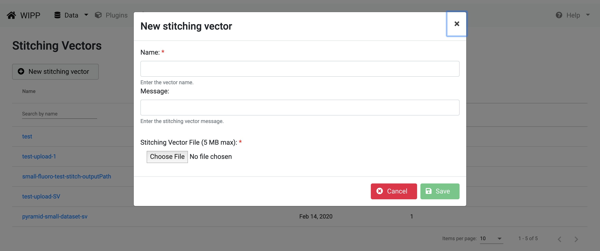

# Stitching Vectors 

Stitching Vectors are generated to gather position information about each small field of view image in the coordinate system of a large field of view image. The Stitching Vectors view exposes the interface for a user to transfer data from disk to the WIPP system and manage the data. The data management includes creation of stitching vectors, uploading and downloading files (time slices). Click on "Data" on the menu bar, then "Stitching Vectos" to access stitching vectors management. 

*Figure1: WIPP Stitching Vectors screenshot*

This view displays the list of available Stitching Vectors, which can be sorted by name and creation date. The sorting is achieved by clicking on the arrows next to the column headings. 
The edit box below the heading "Name" is designed for entering text to filter the list of items shown below. Click on the name of a stitching vector to access the vector details.

# Create a new stitching vector

From the Stitching Vectors view, click on the "New stitching vector" button to create a new vector and start uploading a single time slice:

*Figure 2: WIPP Create Stitching Vector screenshot*

Enter a name of the new stitching vector. Enter an optional message and click on the "Choose File" button to upload a text file form your local disk, the file must be a "txt" file. Then, click on save to proceed to the Stitching Vector detail view.
The file to be uploaded is intended to be used by WIPP plugins, so its content must respect the following format:

file: "image_name.ome.tif"; corr: 0; position: (0, 0); grid: (0, 0);

# Stitching Vector detail information

The information about stitching vectors includes name, creation date, the statistics file and the source job if the vector has been created during the execution of a workflow. The stitching vector name must be unique.

*Figure 3: WIPP Stitching Vector screenshot*

# Download time slices

Each time slice in a stitching vector can be downloaded using the download button with the arrow icon from the "Actions" column. 

# Change Stitching Vector visibility to Public

A Stitching Vector visibility can be changed to "Public" by clicking on the user group icon on the right. 
Public visibility means that the collection can be seen and downloaded by all connected and anonymous users, and can be used by other connected users in workflows. It cannot be modified or deleted by other users, except for admin users.
Once a collection is Public, its visibility can not be changed back to Private.
