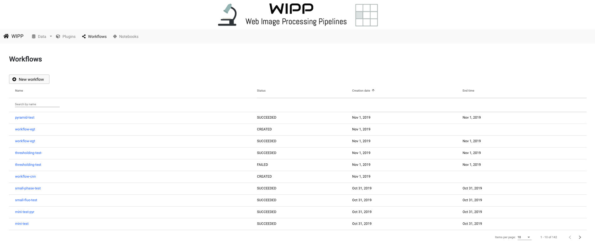
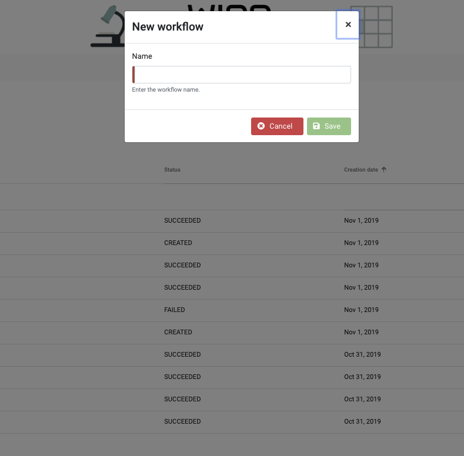
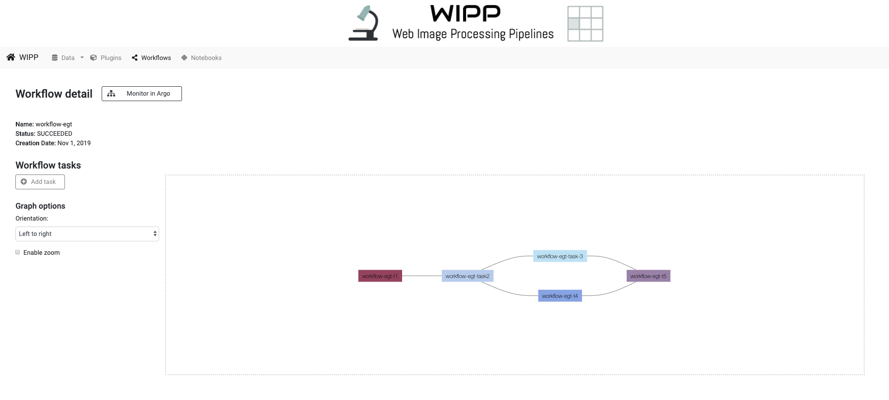
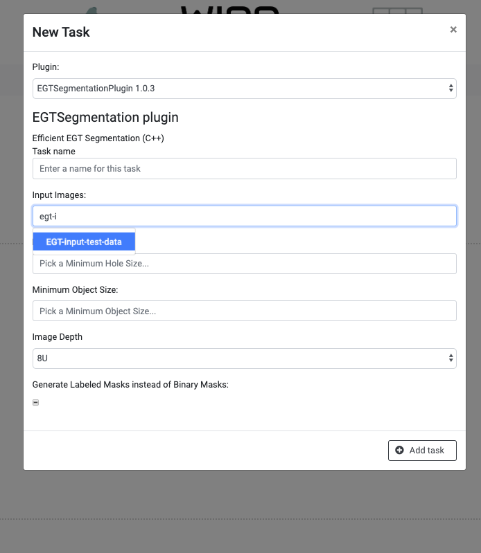
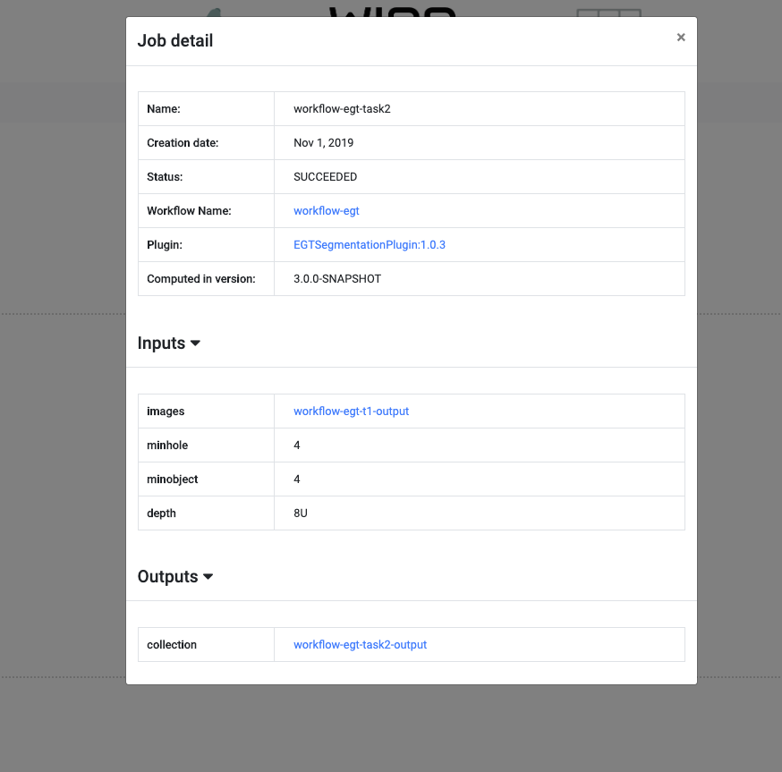
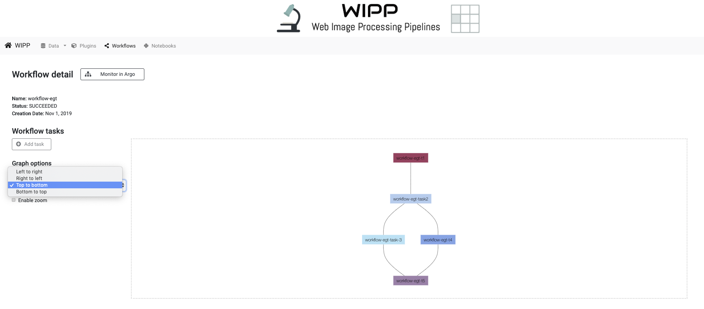
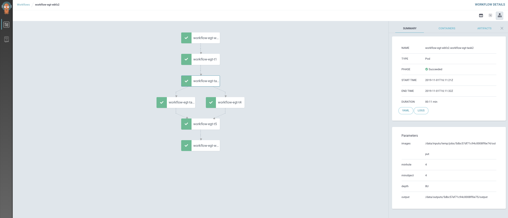

# Workflows

The "Workflows" tab of the navigation bar exposes the list of workflows that have already been created / run in WIPP.
You can browse the different pages and change the number of workflows displayed per page. 
We provide filters to sort workflows by name or creation date, and to search a workflow by its name.

From this page you can:
* click on "New workflow" to create a [new workflow](#new-workflow)
* click on a workflow and see its [details](#workflow-details)

*Figure 1: workflows main page*

# New Workflow

The "New workflow" button opens a pop up that allows the user to create a new workflow.

Just choose a name and hit the "Save" button.

*Figure 2: creation of a new workflow*

# Workflow Details

The workflow details page is displayed after:
* creating a new workflow
* clicking on a workflow to see its details

From there the user can create a new task, see a task details, or submit/monitor a workflow.

*Figure 3: example of a workflow*

The page in separated in two columns. The left columns reads general information about the workflow and contains options to display the graph.
The second column is a box that will contains an interactive graph that represents the different tasks of a workflow.

## New Task
The first step to populate a workflow is to add tasks. To do so, hit the "Add task" button on the left column.
You can add as many tasks as desired.

*Figure 4: creation of a new workflow*

You can choose a plugin between all those available in WIPP. 
Each plugin contains different inputs with different types. 
When looking for data from WIPP (images-collections, stitching-vectors...), just start typing the name and the available data will be suggested by autocomplete. 

*Figure 5: autocomplete of an images-collection*

It is possible to reuse the outputs of previous tasks in a same workflow. Those outputs are written between embraces and are written on top of the in the inputs list.

*Figure 6: reuse an previously created output as an input*

## Task Details

When clicking on a task box on the graph, the details of this task will be displayed.
The blue color indicates that the link is clickable. Thus you can directly access the inputs / outputs that are already created.
Also you can access the plugin and workflow pages. 

*Figure 7: example of task details*

## Display Options

The left column of the page reads "Graph options". It is possible to: 
* enable / disable zoom
* change the orientation of the graph

*Figure 8: graph display options*

# Submit Workflow

When the user is done with creating tasks just hit the "Submit" button on the top of the page.

# Monitor in Argo

Once the workflow is submitted, the "Submit" button will disappear and a "Monitor in Argo" button will be displayed.
Clicking on this button will open the argo dashboard. It s used to follow the progresses of a workflow. 
The workflow is displayed as a graph and you can access the logs of each task.

The left box color of each task is: 
* green if it worked
* orange if it is running
* red if there has been an issue

*Figure 9: Progress of a workflow in Argo*